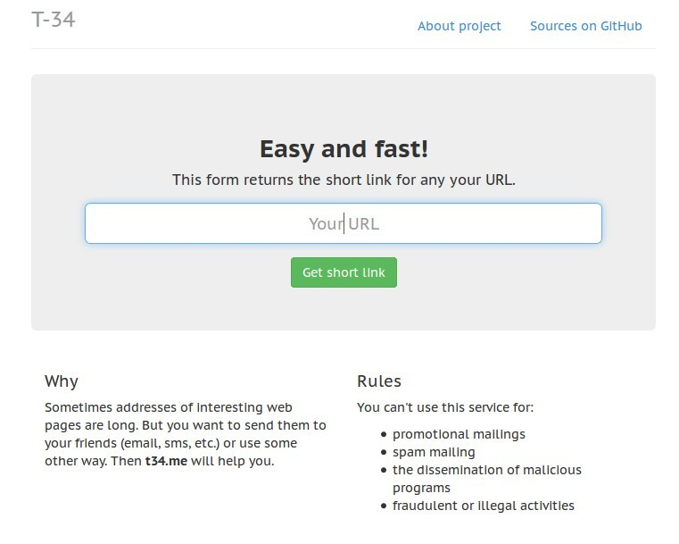
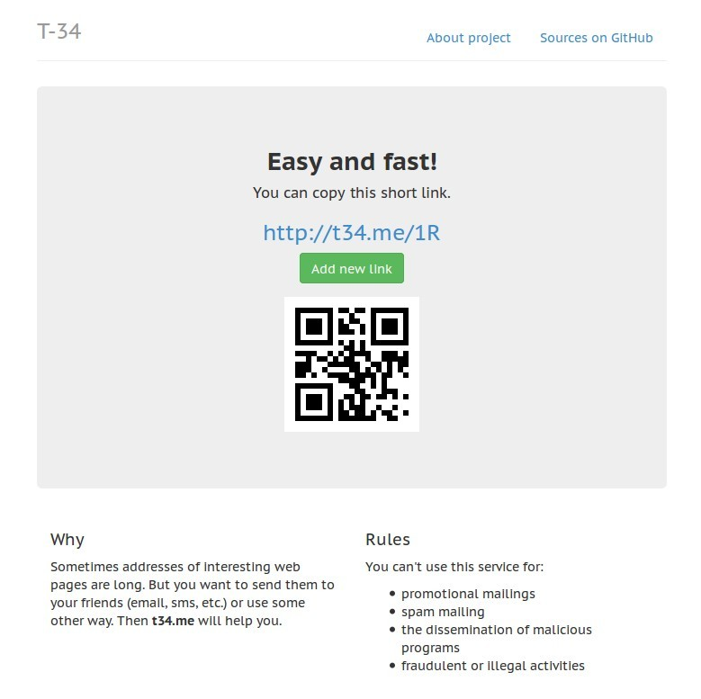

T34.me
======

**[t34.me](http://t34.me/)** is a simple URL shortening web application.

### Resources:

* [Python](http://python.org/)
* [MongoDB](http://www.mongodb.org/)
* [Bottle](http://bottlepy.org/)
* [python-qrcode](https://github.com/lincolnloop/python-qrcode)
* [Pillow](http://python-pillow.github.io/)
* [Boostrap](http://getbootstrap.com/)
* [Pylint](http://www.pylint.org/)
* [flake8](https://gitlab.com/pycqa/flake8)
* [Google Fonts - PT Sans Caption](http://www.google.com/fonts/#ChoosePlace:select/Collection:PT+Sans+Caption)

[AGPLv3](http://www.gnu.org/licenses/agpl.html) license.

---

---

